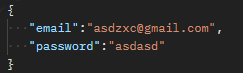
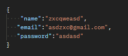
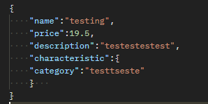

# Pet Project

This project was created in order to show my hard skills.

## Installing

To start the project, follow these steps:

1. Clone the repository: `https://github.com/Onelvay/go-pet-project.git `
2. Go to the project directory: `cd go-pet-project`
3. Launch the application: `make run`

## Technologies

* Docker
* Postgres, Mongo, Redis
* JWT, REST API
* Simulation of payment via fondy

## Project structure
<<<<<<< HEAD

pet-project/ 
├── config/
│   └── handler/
├── db/
│   ├── mongoDB/
│   └── postgres/
├── payment/
│   ├── Request/
│   │   └── request.go
│   └── client/
│       └── client.go
├── pkg/
│   ├── controller/
│   │   ├── handlers.go
│   │   ├── redis.go
│   │   ├── token.go
│   │   ├── user.go
│   │   └── postgres.go
│   ├── domain/
│   │   └── models.go
│   ├── handlers/
│   │   ├── handlers.go
│   │   └── middleware.go
│   ├── routes/
│   │   └── routes.go
│   └── service/
│       ├── interfaces.go
│       └── hash.go
└── redis/
    └── redis.go

Sign-in:

Sign-up:

Purchasing item:

=======

pet-project/  
├── config/ 
│   └── handler/ 
├── db/ 
│   ├── mongoDB/ 
│   └── postgres/ 
├── payment/ 
│   ├── Request/ 
│   │   └── request.go 
│   └── client/ 
│       └── client.go 
├── pkg/ 
│   ├── controller/ 
│   │   ├── handlers.go 
│   │   ├── redis.go 
│   │   ├── token.go 
│   │   ├── user.go 
│   │   └── postgres.go 
│   ├── domain/ 
│   │   └── models.go 
│   ├── handlers/ 
│   │   ├── handlers.go 
│   │   └── middleware.go 
│   ├── routes/ 
│   │   └── routes.go 
│   └── service/ 
│       ├── interfaces.go 
│       └── hash.go 
└── redis/ 
    └── redis.go 

>>>>>>> 08a18cc8b6936ab010b9e2c0f70dee717705bd4a
